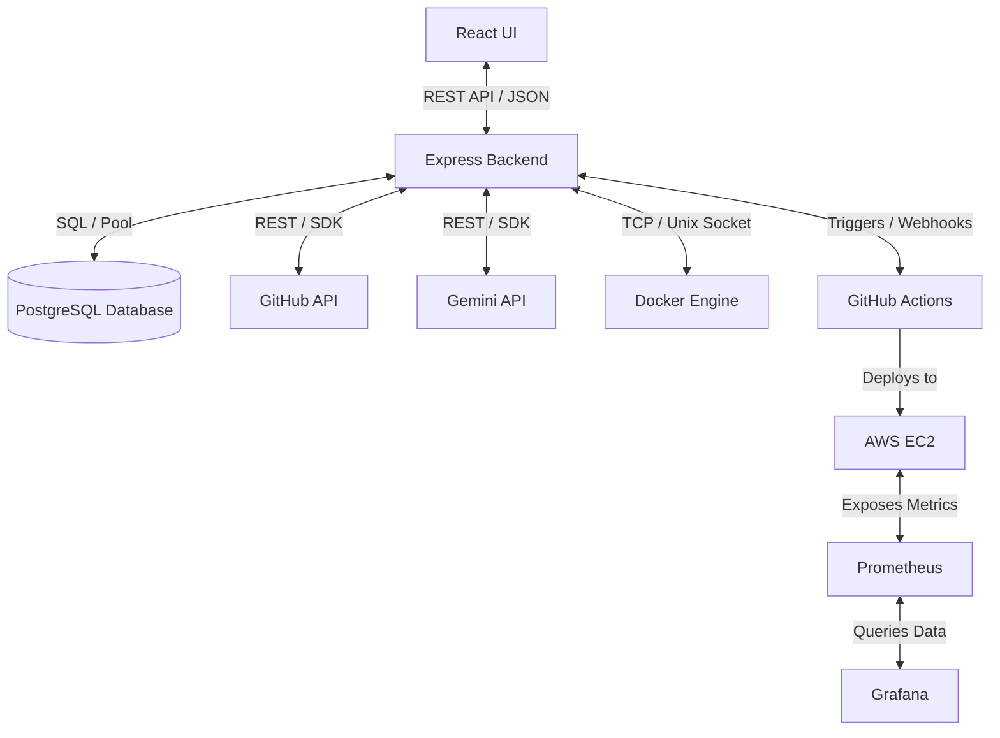

# Architecture Blueprint

This document details the system architecture and data flows for **DevVerse**.

## System Architecture Diagram

## Architectural Components

### 1. Presentation Layer (React UI)
*   Provides a highly responsive dashboard with dynamic components.
*   Interacts with the Express Backend using a structured REST API Client.
*   State management handled via React Context API or custom hooks.

### 2. Application Layer (Express Backend)
*   Acts as the central orchestrator.
*   Exposes endpoints for user account management, project orchestration, and settings.
*   Integrates with external APIs (GitHub REST API, Gemini API, Docker socket, Prometheus metrics endpoint).

### 3. Database Layer (PostgreSQL)
*   Stores persistent structural data:
    *   **Users:** Profiles, credentials, and OAuth tokens.
    *   **Projects:** Repo links, environments, configs.
    *   **Logs & Metadata:** Build histories, docker images metadata, deployment tracking records.

### 4. Integration & Service Layer
*   **Gemini AI service:** Translates docker/build logs into human-readable suggestions, generates workflows, and assists developers.
*   **Docker service:** Communicates with the Docker Engine to build, push, pull, and run images locally or on the host VM.
*   **GitHub service:** Performs repository scanning, hooks setup, branch reads, and tracks commit lists.

### 5. Infrastructure & Deployment (AWS EC2 + CI/CD)
*   **GitHub Actions:** Acts as the runner for builds, tests, and publishing release artifacts.
*   **AWS EC2:** Hosts the platform server, client bundles, and application processes.

### 6. Monitoring & Observability
*   **Prometheus:** Dynamically scrapes telemetry and system stats from Docker Engine and App server endpoints.
*   **Grafana:** Provides graphs and alerts for CPU/RAM usage, API response latency, and build failure rates.
